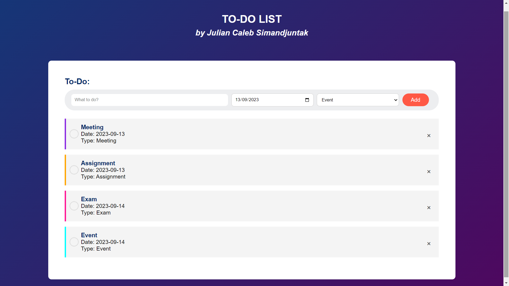

# TO-DO LIST
Name: Julian Caleb Simandjuntak  
GDSC ID: 220020035

## Short description
This website is a simple to-do list that accepts input in the form of the name of the to-do activity, a date such as a deadline or meeting time, and the type of activity, then listed based on the time the input was given, most recently below. To-do items on the list can be checked if they have been done and deleted if they have been done. Websites can be developed with drag systems, systems and filters.

## Tech stack
Tech stack used in this final project are:
- HTML
- CSS
- JavaScript

## Screenshot preview
